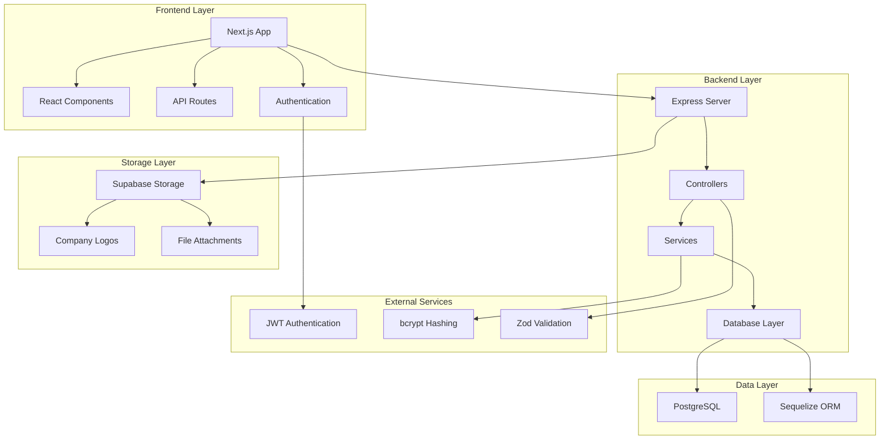
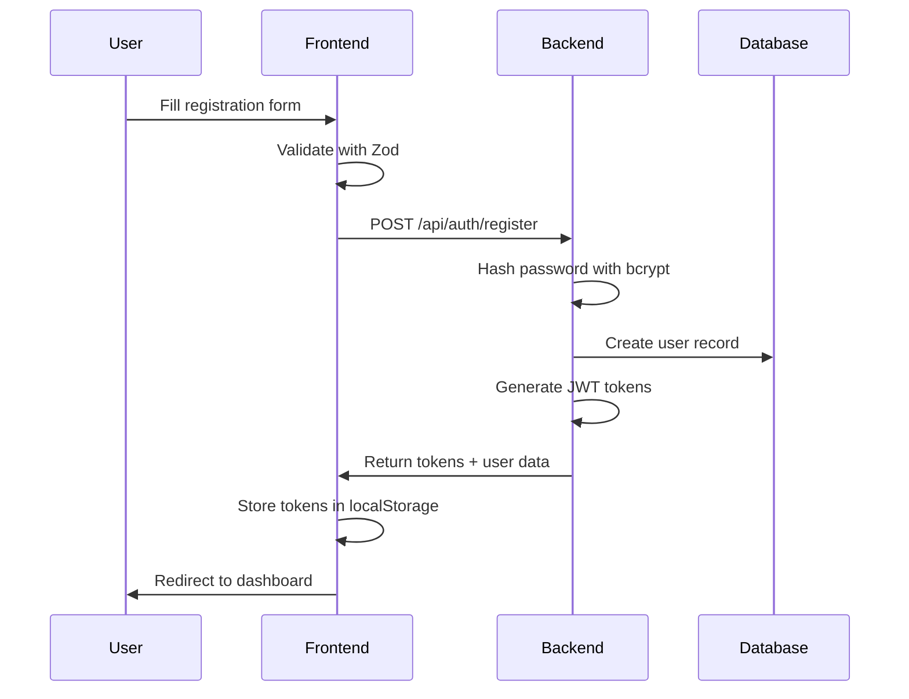
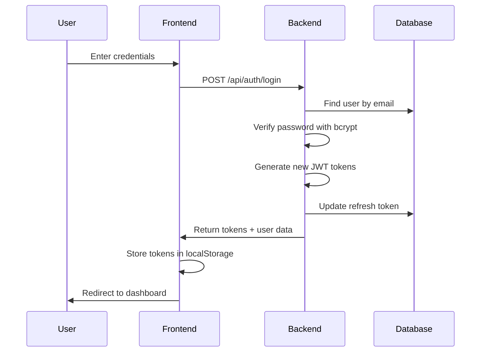
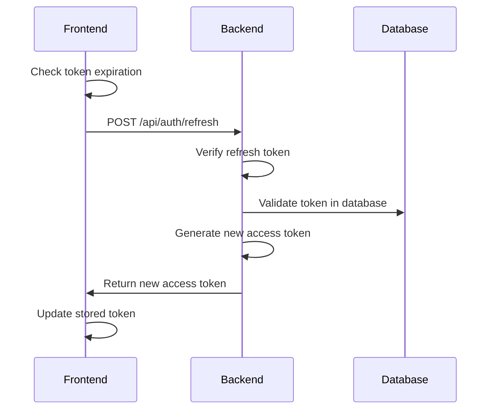
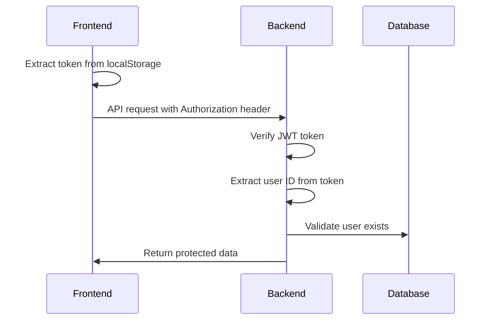
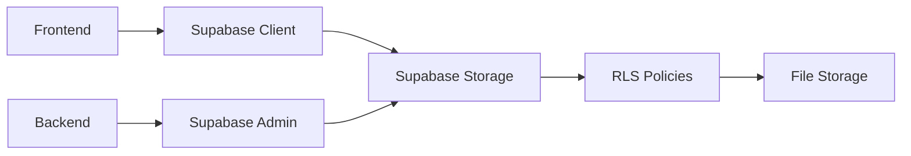
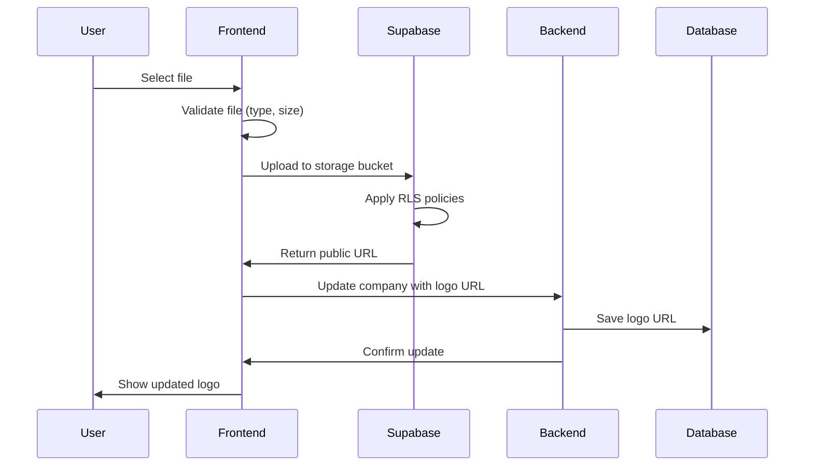
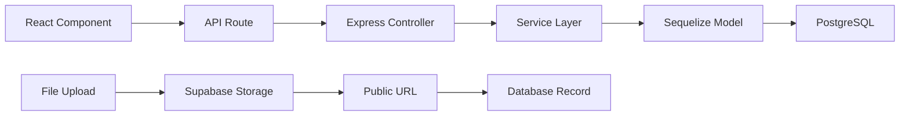
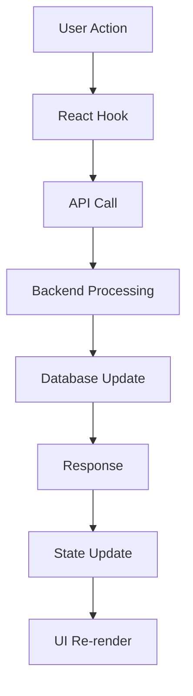

# Architecture Overview

## System Architecture

The Tender Management System is a full-stack B2B platform built with a modern microservices-inspired architecture, featuring a Next.js frontend, Node.js/Express backend, PostgreSQL database, and Supabase storage integration.



## 🏗️ Architecture Components

### Frontend (Next.js 15)
- **Framework**: Next.js with App Router
- **Language**: TypeScript
- **Styling**: Tailwind CSS
- **UI Components**: Radix UI + Custom Components
- **State Management**: React Hooks + Context
- **API Integration**: Fetch API with error handling

### Backend (Node.js/Express)
- **Runtime**: Node.js with TypeScript
- **Framework**: Express.js 5
- **Database**: PostgreSQL with Sequelize ORM
- **Authentication**: JWT with refresh tokens
- **Validation**: Zod schemas
- **Security**: bcrypt password hashing, CORS

### Database (PostgreSQL)
- **RDBMS**: PostgreSQL 12+
- **ORM**: Sequelize with TypeScript
- **Migrations**: Manual SQL migrations
- **Relationships**: Foreign keys with CASCADE
- **Indexes**: Optimized for common queries

### Storage (Supabase)
- **Service**: Supabase Storage
- **Purpose**: Company logos and file attachments
- **Security**: Row Level Security (RLS)
- **Access**: Public read, authenticated write

## 🔐 Authentication Flow

### 1. User Registration


### 2. User Login


### 3. Token Refresh


### 4. Protected Route Access


## 🔌 API Design

### RESTful API Structure

#### Base URL
```
Backend: http://localhost:5000/api
Frontend: http://localhost:3000/api (proxy routes)
```

#### Authentication Endpoints
```
POST   /api/auth/register     # User registration
POST   /api/auth/login        # User login
POST   /api/auth/refresh      # Token refresh
GET    /api/auth/profile      # Get user profile
PUT    /api/auth/profile      # Update user profile
POST   /api/auth/logout       # User logout
```

#### Company Endpoints
```
GET    /api/companies         # List all companies
POST   /api/companies         # Create company profile
GET    /api/companies/:id     # Get company by ID
PUT    /api/companies/:id     # Update company
DELETE /api/companies/:id     # Delete company
POST   /api/company/logo      # Upload company logo
```

#### Tender Endpoints
```
GET    /api/tenders           # List all tenders
POST   /api/tenders           # Create tender
GET    /api/tenders/:id       # Get tender by ID
PUT    /api/tenders/:id       # Update tender
DELETE /api/tenders/:id       # Delete tender
GET    /api/tenders/search    # Search tenders
```

#### Application Endpoints
```
GET    /api/applications      # List applications
POST   /api/applications      # Submit application
GET    /api/applications/:id  # Get application by ID
PUT    /api/applications/:id  # Update application status
GET    /api/applications/user/:userId  # User's applications
GET    /api/applications/tender/:tenderId  # Tender applications
```

### API Response Format

#### Success Response
```json
{
  "success": true,
  "data": {
    // Response data
  },
  "message": "Operation successful"
}
```

#### Error Response
```json
{
  "success": false,
  "error": {
    "code": "VALIDATION_ERROR",
    "message": "Invalid input data",
    "details": [
      {
        "field": "email",
        "message": "Email is required"
      }
    ]
  }
}
```

### Request/Response Examples

#### User Registration
```http
POST /api/auth/register
Content-Type: application/json

{
  "companyname": "TechCorp",
  "firstname": "John",
  "lastname": "Doe",
  "jobtitle": "Manager",
  "email": "john@techcorp.com",
  "password": "securePassword123"
}
```

#### Create Tender
```http
POST /api/tenders
Authorization: Bearer <jwt_token>
Content-Type: application/json

{
  "title": "Website Development",
  "description": "Modern website for our company",
  "category": "Technology",
  "budget": 50000.00,
  "deadline": "2024-03-01T00:00:00Z",
  "location": "New York",
  "requirements": "React, Node.js, PostgreSQL",
  "submissionDeadline": "2024-02-15T00:00:00Z",
  "contactEmail": "contact@company.com",
  "contactPhone": "+1234567890"
}
```

## 💾 Storage Integration

### Supabase Storage Architecture



### Storage Bucket Configuration

#### Company Logos Bucket
```javascript
// Bucket: company-logos
// Access: Public read, authenticated write
// File types: jpg, jpeg, png, webp
// Max size: 5MB
// Naming: timestamp-randomstring.extension
```

#### Storage Policies
```sql
-- Allow authenticated users to upload
CREATE POLICY "Allow authenticated uploads" ON storage.objects
FOR INSERT WITH CHECK (
  bucket_id = 'company-logos' AND 
  auth.role() = 'authenticated'
);

-- Allow public read access
CREATE POLICY "Allow public read" ON storage.objects
FOR SELECT USING (bucket_id = 'company-logos');

-- Allow users to update their own uploads
CREATE POLICY "Allow user updates" ON storage.objects
FOR UPDATE USING (
  bucket_id = 'company-logos' AND 
  auth.uid()::text = (storage.foldername(name))[1]
);
```

### File Upload Flow



### Frontend Integration
```typescript
// Supabase client configuration
const supabase = createClient(
  process.env.NEXT_PUBLIC_SUPABASE_URL!,
  process.env.NEXT_PUBLIC_SUPABASE_ANON_KEY!
);

// File upload function
const uploadLogo = async (file: File) => {
  const fileName = `${Date.now()}-${Math.random().toString(36).substring(2)}.${file.name.split('.').pop()}`;
  
  const { data, error } = await supabase.storage
    .from('company-logos')
    .upload(fileName, file);
    
  if (error) throw error;
  
  const { data: { publicUrl } } = supabase.storage
    .from('company-logos')
    .getPublicUrl(fileName);
    
  return publicUrl;
};
```

## 🔒 Security Architecture

### Authentication Security
- **JWT Tokens**: Access tokens (15min) + Refresh tokens (7 days)
- **Password Hashing**: bcrypt with salt rounds
- **Token Storage**: localStorage with automatic refresh
- **CORS**: Configured for frontend domain
- **Rate Limiting**: Implemented on sensitive endpoints

### Data Security
- **Input Validation**: Zod schemas on all endpoints
- **SQL Injection**: Prevented via Sequelize ORM
- **XSS Protection**: Content Security Policy headers
- **CSRF Protection**: JWT tokens provide CSRF protection

### Storage Security
- **Row Level Security**: Supabase RLS policies
- **File Validation**: Type and size restrictions
- **Access Control**: Public read, authenticated write
- **Virus Scanning**: Consider implementing for uploads

## 📊 Data Flow Architecture

### Frontend to Backend Communication


### State Management Flow


## 🚀 Performance Optimizations

### Frontend Optimizations
- **Code Splitting**: Next.js automatic code splitting
- **Image Optimization**: Next.js Image component
- **Caching**: Browser caching for static assets
- **Lazy Loading**: Components and images

### Backend Optimizations
- **Database Indexes**: Optimized for common queries
- **Connection Pooling**: Sequelize connection pool
- **Query Optimization**: Efficient Sequelize queries
- **Caching**: Consider Redis for frequently accessed data

### Database Optimizations
- **Indexes**: Strategic indexes on foreign keys and search fields
- **Query Optimization**: Efficient JOIN operations
- **Connection Management**: Proper connection pooling
- **Regular Maintenance**: VACUUM and ANALYZE

## 🔄 Deployment Architecture

### Development Environment
```
Frontend: http://localhost:3000
Backend:  http://localhost:5000
Database: localhost:5432
Storage:  Supabase (cloud)
```

### Production Environment
```
Frontend: Vercel/Netlify
Backend:  Railway/Heroku/AWS
Database: PostgreSQL (managed)
Storage:  Supabase (cloud)
```

### Environment Variables
```env
# Frontend (.env.local)
NEXT_PUBLIC_BACKEND_URL=http://localhost:5000
NEXT_PUBLIC_SUPABASE_URL=your_supabase_url
NEXT_PUBLIC_SUPABASE_ANON_KEY=your_supabase_key

# Backend (.env)
DB_HOST=localhost
DB_PORT=5432
DB_NAME=tender
DB_USER=postgres
DB_PASSWORD=your_password
JWT_SECRET=your_jwt_secret
SUPABASE_URL=your_supabase_url
SUPABASE_ANON_KEY=your_supabase_key
```

## 📈 Scalability Considerations

### Horizontal Scaling
- **Load Balancing**: Multiple backend instances
- **Database Replication**: Read replicas for queries
- **CDN**: Static asset delivery
- **Microservices**: Split by domain (auth, tenders, etc.)

### Vertical Scaling
- **Database Optimization**: Query tuning, indexing
- **Caching Strategy**: Redis for session and data caching
- **Connection Pooling**: Optimize database connections
- **Resource Monitoring**: CPU, memory, disk usage

## 🔍 Monitoring and Logging

### Application Monitoring
- **Error Tracking**: Sentry or similar service
- **Performance Monitoring**: APM tools
- **User Analytics**: Google Analytics
- **Database Monitoring**: Query performance tracking

### Logging Strategy
- **Structured Logging**: JSON format logs
- **Log Levels**: ERROR, WARN, INFO, DEBUG
- **Log Aggregation**: Centralized logging system
- **Audit Trails**: User action logging

---

**Architecture Version**: 1.0.0  
**Last Updated**: January 2024  
**Maintainer**: Development Team 