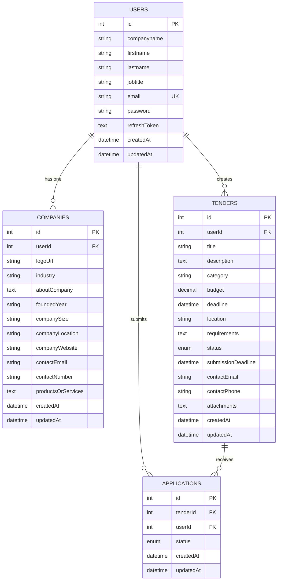

# Database ER Diagram

## Entity Relationship Diagram for Tender Management System

## Database Schema Overview

### 1. Users Table
- **Primary Key**: `id` (Auto-incrementing integer)
- **Unique Constraint**: `email`
- **Purpose**: Stores user authentication and profile information
- **Key Fields**:
  - `companyname`: Company name for the user
  - `firstname`, `lastname`: User's full name
  - `jobtitle`: User's job position
  - `email`: Unique email for login
  - `password`: Hashed password
  - `refreshToken`: JWT refresh token for authentication

### 2. Companies Table
- **Primary Key**: `id` (Auto-incrementing integer)
- **Foreign Key**: `userId` → `Users.id`
- **Purpose**: Stores detailed company information
- **Key Fields**:
  - `logoUrl`: URL to company logo (stored in Supabase)
  - `industry`: Company's industry sector
  - `aboutCompany`: Detailed company description
  - `foundedYear`: Year company was established
  - `companySize`: Number of employees
  - `companyLocation`: Physical location
  - `companyWebsite`: Company website URL
  - `contactEmail`, `contactNumber`: Contact information
  - `productsOrServices`: Description of offerings

### 3. Tenders Table
- **Primary Key**: `id` (Auto-incrementing integer)
- **Foreign Key**: `userId` → `Users.id`
- **Purpose**: Stores tender/project information
- **Key Fields**:
  - `title`: Tender title
  - `description`: Detailed tender description
  - `category`: Tender category/type
  - `budget`: Project budget (decimal with 2 decimal places)
  - `deadline`: Project completion deadline
  - `location`: Project location
  - `requirements`: Project requirements
  - `status`: Tender status (open, in_progress, awarded, closed)
  - `submissionDeadline`: Application submission deadline
  - `contactEmail`, `contactPhone`: Contact information
  - `attachments`: Additional files (JSON or text)

### 4. Applications Table
- **Primary Key**: `id` (Auto-incrementing integer)
- **Foreign Keys**: 
  - `tenderId` → `Tenders.id`
  - `userId` → `Users.id`
- **Purpose**: Stores applications submitted for tenders
- **Key Fields**:
  - `status`: Application status (pending, approved, rejected)
  - `createdAt`, `updatedAt`: Timestamps

## Relationships

1. **User → Company**: One-to-One relationship
   - Each user can have one company profile
   - Each company belongs to one user

2. **User → Tenders**: One-to-Many relationship
   - Each user can create multiple tenders
   - Each tender belongs to one user (creator)

3. **User → Applications**: One-to-Many relationship
   - Each user can submit multiple applications
   - Each application belongs to one user

4. **Tender → Applications**: One-to-Many relationship
   - Each tender can receive multiple applications
   - Each application belongs to one tender

## Data Types and Constraints

### Enums
- **Tender Status**: `open`, `in_progress`, `awarded`, `closed`
- **Application Status**: `pending`, `approved`, `rejected`

### Constraints
- **NOT NULL**: Most fields are required
- **UNIQUE**: Email addresses must be unique
- **FOREIGN KEY**: Proper referential integrity
- **AUTO INCREMENT**: Primary keys auto-increment
- **TIMESTAMPS**: Automatic creation and update timestamps

## Indexes (Recommended)
- `Users.email` (UNIQUE)
- `Companies.userId` (FOREIGN KEY)
- `Tenders.userId` (FOREIGN KEY)
- `Applications.tenderId` (FOREIGN KEY)
- `Applications.userId` (FOREIGN KEY)
- `Tenders.status` (for filtering)
- `Applications.status` (for filtering) 