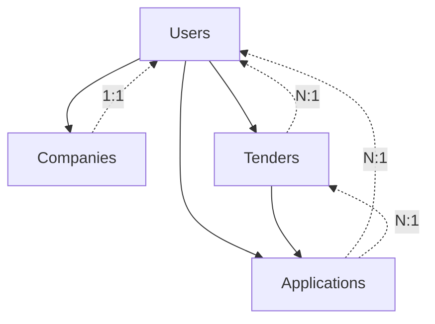

# Database Documentation

## Overview

This document provides comprehensive documentation for the Tender Management System database schema, including ER diagrams, migration files, and usage instructions.

## 📁 File Structure

```
database/
├── README.md                           # This documentation file
├── ER_Diagram.md                       # Entity Relationship Diagram
├── setup_database.sql                  # Complete database setup script
└── migrations/
    ├── 000_master_migration.sql        # Complete migration (all tables)
    ├── 001_create_users_table.sql      # Users table migration
    ├── 002_create_companies_table.sql  # Companies table migration
    ├── 003_create_tenders_table.sql    # Tenders table migration
    └── 004_create_applications_table.sql # Applications table migration
```

## 🗄️ Database Schema

### Tables Overview

| Table | Purpose | Records |
|-------|---------|---------|
| `Users` | User authentication and profiles | User accounts |
| `Companies` | Company information | One per user |
| `Tenders` | Tender/project listings | Multiple per user |
| `Applications` | Tender applications | Multiple per tender/user |

### Relationships



## 🚀 Quick Setup

### Prerequisites
- PostgreSQL 12 or higher
- psql command-line tool
- Superuser access (postgres user)

### 1. Create Database and Run Migrations

```bash
# Connect as postgres superuser
psql -U postgres -f database/setup_database.sql
```

### 2. Verify Setup

```bash
# Connect to the database
psql -U postgres -d tender

# List all tables
\dt+

# Show table structure
\d "Users"
\d "Companies"
\d "Tenders"
\d "Applications"
```

## 📊 Table Details

### Users Table

**Purpose**: Stores user authentication and profile information

**Key Fields**:
- `id`: Primary key (SERIAL)
- `email`: Unique email for login (UNIQUE constraint)
- `password`: Hashed password using bcrypt
- `companyname`, `firstname`, `lastname`, `jobtitle`: Profile information
- `refreshToken`: JWT refresh token for authentication

**Indexes**:
- `idx_users_email`: For fast email lookups
- `idx_users_created_at`: For sorting by creation date

**Constraints**:
- `email` UNIQUE
- All profile fields NOT NULL

### Companies Table

**Purpose**: Stores detailed company information linked to users

**Key Fields**:
- `id`: Primary key (SERIAL)
- `userId`: Foreign key to Users table
- `logoUrl`: URL to company logo (Supabase storage)
- `industry`, `aboutCompany`: Company details
- `companyLocation`, `contactEmail`, `contactNumber`: Contact info

**Indexes**:
- `idx_companies_user_id`: Foreign key index
- `idx_companies_industry`: For filtering by industry
- `idx_companies_location`: For location-based queries
- `idx_companies_user_unique`: Ensures one company per user

**Constraints**:
- `userId` FOREIGN KEY REFERENCES Users(id) CASCADE
- `userId` UNIQUE (one company per user)

### Tenders Table

**Purpose**: Stores tender/project information created by users

**Key Fields**:
- `id`: Primary key (SERIAL)
- `userId`: Foreign key to Users table (creator)
- `title`, `description`: Tender details
- `budget`: Project budget (DECIMAL(15,2))
- `deadline`, `submissionDeadline`: Important dates
- `status`: Enum ('open', 'in_progress', 'awarded', 'closed')

**Enums**:
```sql
CREATE TYPE tender_status_enum AS ENUM (
    'open', 
    'in_progress', 
    'awarded', 
    'closed'
);
```

**Indexes**:
- `idx_tenders_user_id`: Foreign key index
- `idx_tenders_status`: For status filtering
- `idx_tenders_category`: For category filtering
- `idx_tenders_location`: For location filtering
- `idx_tenders_deadline`: For deadline sorting
- `idx_tenders_budget`: For budget range queries

**Constraints**:
- `userId` FOREIGN KEY REFERENCES Users(id) CASCADE
- `budget` > 0 (application-level constraint)

### Applications Table

**Purpose**: Stores applications submitted by users for tenders

**Key Fields**:
- `id`: Primary key (SERIAL)
- `tenderId`: Foreign key to Tenders table
- `userId`: Foreign key to Users table (applicant)
- `status`: Enum ('pending', 'approved', 'rejected')

**Enums**:
```sql
CREATE TYPE application_status_enum AS ENUM (
    'pending', 
    'approved', 
    'rejected'
);
```

**Indexes**:
- `idx_applications_tender_id`: Foreign key index
- `idx_applications_user_id`: Foreign key index
- `idx_applications_status`: For status filtering
- `idx_applications_tender_user`: Composite index
- `idx_applications_tender_user_unique`: Prevents duplicate applications

**Constraints**:
- `tenderId` FOREIGN KEY REFERENCES Tenders(id) CASCADE
- `userId` FOREIGN KEY REFERENCES Users(id) CASCADE
- `(tenderId, userId)` UNIQUE (one application per user per tender)

## 🔍 Common Queries

### 1. Get User with Company Profile

```sql
SELECT 
    u.id,
    u.firstname,
    u.lastname,
    u.email,
    c.companyname,
    c.industry,
    c.companyLocation
FROM "Users" u
LEFT JOIN "Companies" c ON u.id = c.userId
WHERE u.id = $1;
```

### 2. Get Tenders with Creator Information

```sql
SELECT 
    t.id,
    t.title,
    t.description,
    t.budget,
    t.status,
    t.deadline,
    u.firstname,
    u.lastname,
    c.companyname
FROM "Tenders" t
JOIN "Users" u ON t.userId = u.id
LEFT JOIN "Companies" c ON u.id = c.userId
WHERE t.status = 'open'
ORDER BY t.createdAt DESC;
```

### 3. Get Applications with Details

```sql
SELECT 
    a.id,
    a.status,
    a.createdAt,
    t.title as tender_title,
    t.budget,
    u.firstname,
    u.lastname,
    c.companyname
FROM "Applications" a
JOIN "Tenders" t ON a.tenderId = t.id
JOIN "Users" u ON a.userId = u.id
LEFT JOIN "Companies" c ON u.id = c.userId
WHERE a.tenderId = $1
ORDER BY a.createdAt DESC;
```

### 4. Get User's Applications

```sql
SELECT 
    a.id,
    a.status,
    a.createdAt,
    t.title,
    t.budget,
    t.deadline,
    t.status as tender_status
FROM "Applications" a
JOIN "Tenders" t ON a.tenderId = t.id
WHERE a.userId = $1
ORDER BY a.createdAt DESC;
```

### 5. Get Tender Statistics

```sql
SELECT 
    t.id,
    t.title,
    COUNT(a.id) as application_count,
    COUNT(CASE WHEN a.status = 'approved' THEN 1 END) as approved_count,
    COUNT(CASE WHEN a.status = 'rejected' THEN 1 END) as rejected_count
FROM "Tenders" t
LEFT JOIN "Applications" a ON t.id = a.tenderId
GROUP BY t.id, t.title
ORDER BY application_count DESC;
```

## 🔧 Maintenance Queries

### 1. Check Database Size

```sql
SELECT 
    schemaname,
    tablename,
    pg_size_pretty(pg_total_relation_size(schemaname||'.'||tablename)) as size
FROM pg_tables 
WHERE schemaname = 'public'
ORDER BY pg_total_relation_size(schemaname||'.'||tablename) DESC;
```

### 2. Check Index Usage

```sql
SELECT 
    schemaname,
    tablename,
    indexname,
    idx_scan,
    idx_tup_read,
    idx_tup_fetch
FROM pg_stat_user_indexes 
WHERE schemaname = 'public'
ORDER BY idx_scan DESC;
```

### 3. Check Table Statistics

```sql
SELECT 
    schemaname,
    tablename,
    n_tup_ins as inserts,
    n_tup_upd as updates,
    n_tup_del as deletes,
    n_live_tup as live_rows,
    n_dead_tup as dead_rows
FROM pg_stat_user_tables 
WHERE schemaname = 'public'
ORDER BY n_live_tup DESC;
```

## 🛡️ Security Considerations

### 1. Password Security
- Passwords are hashed using bcrypt
- Salt rounds should be configured appropriately
- Never store plain text passwords

### 2. JWT Tokens
- Refresh tokens are stored in the database
- Implement token rotation for security
- Set appropriate expiration times

### 3. Data Validation
- Use application-level validation (Zod schemas)
- Implement database constraints
- Sanitize user inputs

### 4. Access Control
- Implement row-level security (RLS) if needed
- Use proper authentication middleware
- Validate user permissions for operations

## 🔄 Backup and Recovery

### 1. Create Backup

```bash
# Full database backup
pg_dump -U postgres -d tender -f tender_backup_$(date +%Y%m%d_%H%M%S).sql

# Backup with custom format (recommended)
pg_dump -U postgres -d tender -Fc -f tender_backup_$(date +%Y%m%d_%H%M%S).dump
```

### 2. Restore Backup

```bash
# Restore from SQL file
psql -U postgres -d tender -f tender_backup_20240101_120000.sql

# Restore from custom format
pg_restore -U postgres -d tender tender_backup_20240101_120000.dump
```

## 📈 Performance Optimization

### 1. Query Optimization
- Use appropriate indexes
- Avoid SELECT * queries
- Use LIMIT for large result sets
- Implement pagination

### 2. Connection Pooling
- Use connection pooling in your application
- Configure appropriate pool sizes
- Monitor connection usage

### 3. Regular Maintenance
- Run VACUUM regularly
- Update table statistics
- Monitor slow queries
- Optimize indexes based on usage

## 🐛 Troubleshooting

### Common Issues

1. **Connection Refused**
   - Check if PostgreSQL is running
   - Verify connection parameters
   - Check firewall settings

2. **Permission Denied**
   - Ensure proper user permissions
   - Check database ownership
   - Verify connection credentials

3. **Foreign Key Violations**
   - Check data integrity
   - Verify cascade delete settings
   - Review application logic

4. **Performance Issues**
   - Check query execution plans
   - Review index usage
   - Monitor resource usage

### Debug Commands

```sql
-- Check active connections
SELECT * FROM pg_stat_activity;

-- Check locks
SELECT * FROM pg_locks;

-- Check table sizes
SELECT 
    tablename,
    pg_size_pretty(pg_total_relation_size(tablename::regclass))
FROM pg_tables 
WHERE schemaname = 'public';

-- Check slow queries
SELECT query, mean_time, calls 
FROM pg_stat_statements 
ORDER BY mean_time DESC 
LIMIT 10;
```

## 📚 Additional Resources

- [PostgreSQL Documentation](https://www.postgresql.org/docs/)
- [Sequelize Documentation](https://sequelize.org/)
- [Database Design Best Practices](https://www.postgresql.org/docs/current/ddl.html)
- [Performance Tuning](https://www.postgresql.org/docs/current/performance-tips.html)

---

**Last Updated**: January 2024  
**Version**: 1.0.0  
**Maintainer**: Development Team 